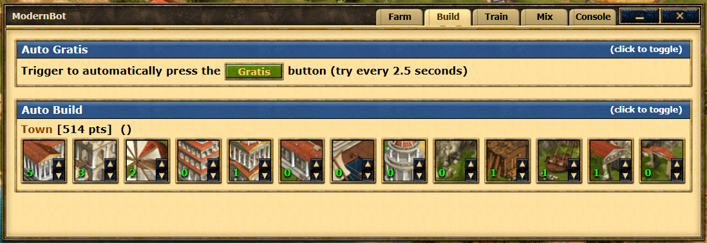

# ModernBot




<br />

## Installation

### <div align="center"> [Version 1.0](https://github.com/Sau1707/ModernBot/raw/refs/heads/main/dist/merged.user.js) </div>

Version 2.0 Work in progress

ModerLite Work in progress

<br />

## Script

The script it's divided in modules under the `src` directory.

by running in the main folder

```
npm install
npm run dev
```

it will create a nodemon server that listen to changes in the code. Each time a file it's saved all the modules are merged into one under the dist folder

Place this into a tampermokey script:

```
// ==UserScript==
// @name         GrepoTest
// @author       Sau1707
// @description
// @version      1.0.0
// @match        http://*.grepolis.com/game/*
// @match        https://*.grepolis.com/game/*
// @require      file://C:\[path]\ModernBot\dist\modernbot.user.js
// ==/UserScript==
```

In case of loading error `@require: couldn't load ` go to

```
chrome://extensions/
```

Then select tampermoney and add `Allow access to file URLs`

<br />

## Disclaimer

This open-source bot is designed for use with Grepolis, a video game developed by InnoGames. However, please note that this bot is not endorsed or approved by InnoGames, and the use of this bot may be against the game's terms of service. We do not encourage or condone the use of this bot to gain an unfair advantage or violate the game's rules.

The use of this bot is entirely at your own risk, and we accept no liability for any consequences that may arise from its use. By using this bot, you acknowledge and accept that InnoGames may take action against your account for violating their terms of service. We strongly recommend that you read and understand the game's rules before using this bot.

Additionally, this bot is provided as open-source software, and we do not offer any technical support or assistance in its installation, configuration, or use. You are solely responsible for any modifications or customizations you make to the bot's code, and we accept no responsibility for any issues that may arise as a result.

By using this bot, you acknowledge and accept these terms and conditions and agree to use it responsibly and in accordance with the applicable laws and regulations.

- Icons from [flaticon](https://www.flaticon.com/)
